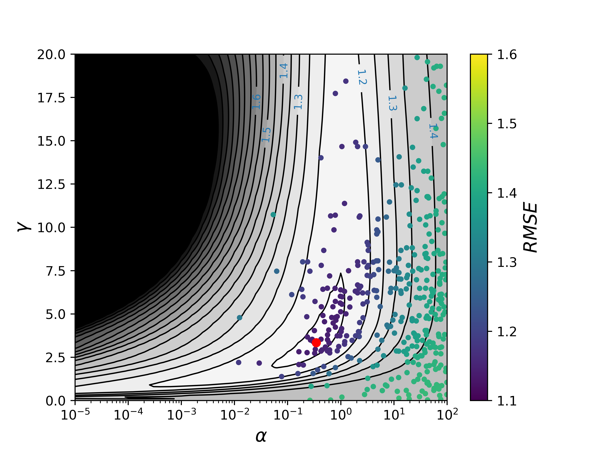

# genetic-algorithm-hyperparams-opt
Use genetic algorithm to find the best combination of parameters for Machine Learning models 

Genetic algorithms, such as Differential Evolution, make use of basic concepts from evolution by natural selection. In our case, we have a population formed by vectors that contain parameters with distinct values. Parameters are equivalent to genes in biological systems. Their exact value differs between different vectors. Different combinations of parameters cause vectors to display different fitness values. Random parameter mutations are introduced in the population, and vectors with a larger fitness outlive other vectors.

## How does a genetic algorithm for hyperparams optimisation work?
Using an iterative process, Differential Evolution can minimize a function following steps:
- Initialization: create an initial population with random parameter values within boundaries.
- Initial evaluation: calculate function value for the generated vectors of parameters.
- For each vector in the population we build a mutant vector, where each parameter’s value is calculated as a mutation of the parameters of other vectors randomly chosen from the population. A trial vector is then created by selecting each of its parameters as either the value of the current vector or the value of the mutant vector. For each parameter, we generate a random uniform number R in the (0,1) interval. If R is lower than a recombination rate, then we accept the mutant parameter; otherwise, we use the parameter of the current parameter.
- We then evaluate the function of the trial vector. If it’s more stable than the current one, substitute the current vector by the trial vector.
- Repeat Steps 3 and 4 until population convergence: iteration stops when the standard deviation of the function within the population is smaller than a specific percentage of the mean value of the function. Loop also stops if convergence is not reached after a maximum number of iterations.

## Our case study

Here we generate a synthetic dataset and we use Kernel Ridge Regression (KRR) with radial basis function kernel for KRR, which depends on the Gaussian kernel variance γ. amd the regularization hyperparameter α. Here we use a 10-fold cross-validation and RMSE as the loss function. We use the **Differential Evolution algorithm provided by Scipy** to optimize the hyperparameters by minimizing the RMSE of our model. Scipy’s differential_evolution function needs as input:
- KRR_function. This is the function whose output (RMSE) will be minimized. It needs as input: i) tuple with hyperparameters to optimize (α and γ) and ii) X, y variables containing our data.
- Define boundaries of possible values of hyperparameters.
- Extra variables used by KRR_function. In our case, this will be given as a tuple containing X and y.
- 
Other relevant options for the Differential Evolution algorithm are :
- Strategy. In our case, the default strategy=’best1bin’ is good enough. With this strategy, the value of each parameter of the mutant vectors is obtained as a variation of the best vector’s value for that parameter, proportionally to the difference of two other random vectors.
- Population size. This selects how many vectors we will consider. A larger number will slow down progress but will make it more likely to discover the global minimum. Here, we use the default value of popsize=15.
- Mutation constant. This value controls how much the parameters change during the mutation stage. A larger value means a larger search radius but slows down convergence. We use the default value of mutation=0.5.
- Recombination constant. This constant controls how likely the parameters of trial vectors are to change during the recombination stage. Larger values mean that mutations are more likely to be accepted, which may accelerate convergence at the risk of causing population instability. We use the default value of recombination=0.7.
- Tolerance. This value controls when the algorithm is considered to converge. We will use tol=0.01, meaning that the algorithm is considered to be converged when the standard deviation of the RMSE of all vectors in the population is smaller than 1% of the average RMSE.

## Results 

We can observe how the algorithm has been exploring different configurations within the set boundaries and it has eventually converged into an (α,γ) combination that minimizes the RMSE.

